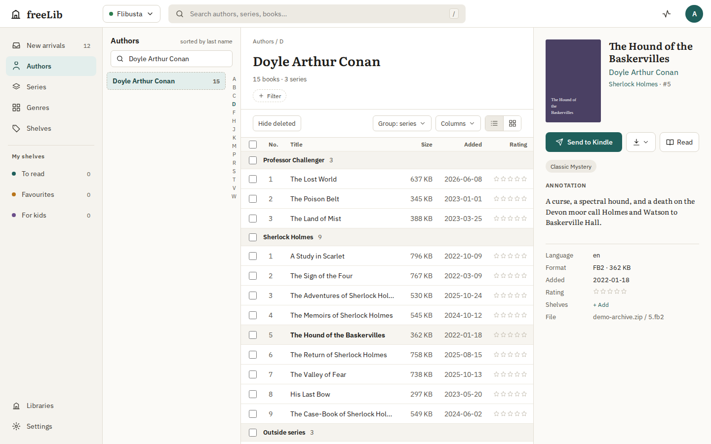
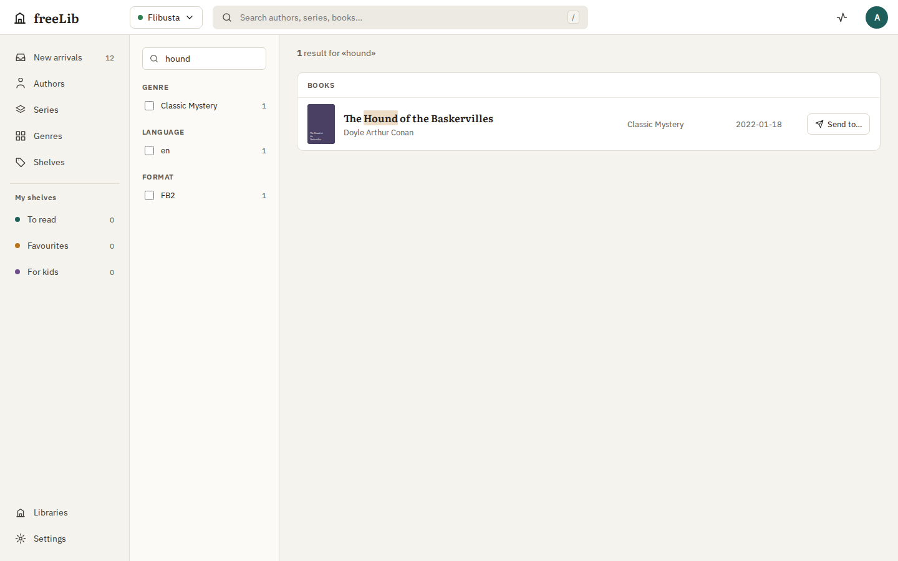
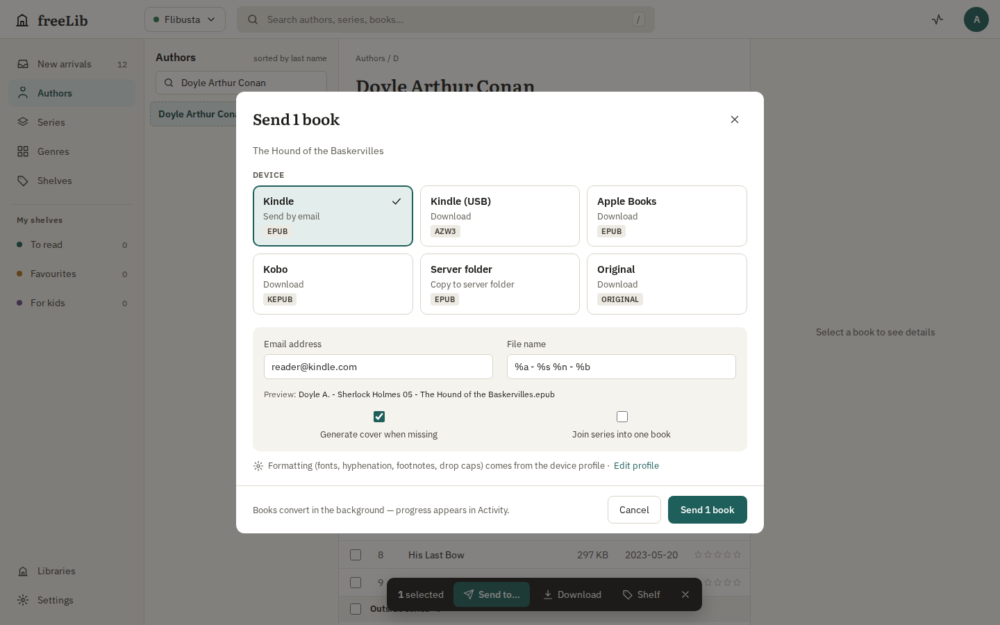
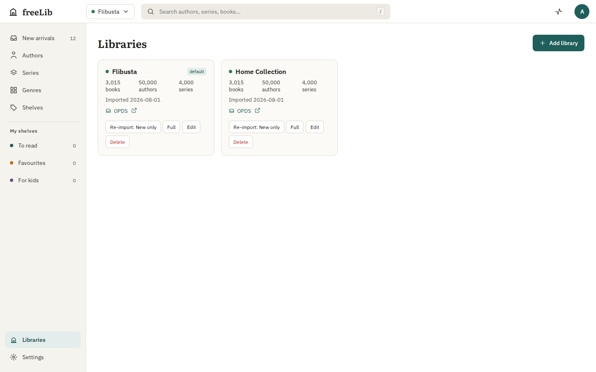
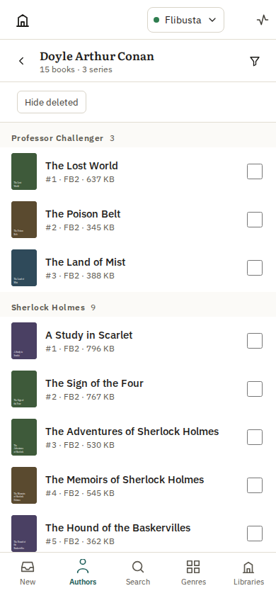

# freeLib Web

A self-hosted web catalog for large e-book libraries described by INPX files (Flibusta, Lib.rus.ec and similar collections). Browse and search hundreds of thousands of books in the browser, read them online, send them to Kindle, or download them for Apple Books, Kobo and other readers — all from a single Docker container.



## Features

- **INPX libraries** — add a library by pointing at its `.inpx` file and the folder with the book archives. Re-imports rebuild the catalog in the background while the old one keeps serving. Several libraries can live side by side.
- **Fast on big catalogs** — on a 600,000-book library the full import takes about 16 seconds, author lists load in milliseconds and search answers in well under 100 ms.
- **Browse the way you know** — authors, series and genres with an alphabet index and instant filtering, a book table grouped by series or a cover grid, book details with cover and annotation, new arrivals since your last visit, shelves and ratings.
- **Search** — full-text search over titles, authors, series and keywords with filters for genre, language, format and date added.
- **Send to devices**
  - **Kindle** — Send to Kindle by email (EPUB), or AZW3 for USB sideloading
  - **Apple Books** — EPUB 3 that passes epubcheck, with pop-up footnotes
  - **Kobo** — KEPUB
  - the original file, or a copy into a server folder
  - per-device formatting: hyphenation, footnote style, drop caps, generated covers, embedded fonts, custom CSS, file name templates, joining a series into one book
- **Read in the browser** — a built-in EPUB reader with table of contents, themes and remembered position.
- **OPDS catalog** — use KOReader, Moon+ Reader, KyBook or FBReader directly with the server (`/opds`).
- **Multi-user** — accounts with admin and reader roles, personal shelves, ratings and devices.
- **Works on phones** — responsive layout with a bottom tab bar; light and dark themes; English, Russian and Ukrainian.

<p>
  
  
</p>
<p>
  
  
</p>

## Quick start

```bash
mkdir freelib && cd freelib
curl -O https://raw.githubusercontent.com/Kwull/freeLib/master/docker/docker-compose.yml
echo "FREELIB_ADMIN_PASSWORD=change-me" > .env
mkdir books data cache export   # put your .inpx file and the book archives in books/
sudo chown 1000:1000 data cache export   # the container runs as uid 1000
docker compose up -d
```

Open <http://localhost:8080>, sign in as `admin`, go to **Libraries → Add library** and pick the `.inpx` file and the archive folder. To import automatically on start, set `FREELIB_AUTOIMPORT=/books/<name>.inpx` (archives in `/books/<name>/` next to it are found automatically).

Images (amd64 and arm64):

| Image | Contents |
|---|---|
| `ghcr.io/kwull/freelib:latest` | Full image with Calibre — adds AZW3, MOBI and PDF output |
| `ghcr.io/kwull/freelib:slim` | Without Calibre — EPUB and KEPUB output, enough for Send to Kindle and Apple Books |

Volumes: `/books` (your library, read-only), `/data` (databases — back this up), `/cache` (covers and converted books, safe to delete), `/export` (server-folder exports).

See **[docs/web/DOCKER.md](docs/web/DOCKER.md)** for all settings, reverse proxy examples (nginx, Caddy, Apache), OPDS setup and backups.

### Important settings

| Variable | Purpose |
|---|---|
| `FREELIB_ADMIN_PASSWORD` | Admin password. Without it (and without users) the server runs in open mode with no login — only for trusted home networks |
| `FREELIB_ALLOWED_HOSTS` | Host names the server answers to besides `localhost` and IP addresses, e.g. `books.example.com` |
| `FREELIB_TRUST_PROXY` | Set to `1` when running behind a reverse proxy |
| `FREELIB_AUTOIMPORT` | Comma-separated INPX files to import on start |
| `FREELIB_CACHE_MAX_MB` | Cache size limit (default 2048) |

Send to Kindle needs SMTP settings (**Settings → Mail**). By default mail may only go to `*@kindle.com` and `*@free.kindle.com`; add your own patterns there. Remember to add the sender address to your Amazon approved senders list.

### Coming from the desktop freeLib

The server can import libraries, tags (as shelves) and ratings from an existing desktop `freeLib.sqlite`:

```bash
docker compose run --rm -v /path/to/freeLib.sqlite:/import.sqlite:ro freelib freelib-server migrate-qt /import.sqlite
```

Library paths from the desktop app must point inside `/books` in the container.

## Architecture

| Path | What |
|---|---|
| `server/crates/catalog` | Per-library SQLite catalog: Cyrillic-aware sorting, FTS5 search, counts and letter index |
| `server/crates/import` | Parallel INPX importer, desktop-database migration, synthetic library generator and benchmarks |
| `server/crates/fb2conv` | FB2 reader and FB2 → EPUB 3 / KEPUB converter |
| `server/crates/server` | `freelib-server`: HTTP API, OPDS, accounts, background jobs, e-mail, embedded web app |
| `web/` | Svelte 5 + TypeScript web app |
| `docker/` | Dockerfile (`full` and `slim` targets) and compose file |
| `docs/web/` | [Architecture](docs/web/ARCHITECTURE.md), [HTTP API](docs/web/API.md), [Docker guide](docs/web/DOCKER.md) |

The original Qt desktop application is still available in `freeLib/`.

## Development

Requirements: Rust (stable), Node.js 22 and pnpm 10.

```bash
# web app against a built-in mock API — no server needed
cd web && pnpm install && pnpm dev

# server with a generated test library
cd server
cargo run --release -p freelib-import --bin gen-inpx -- --books 20000 --out ../dev/lib.inpx --with-files ../dev/lib
FREELIB_BOOKS_DIR=$PWD/../dev FREELIB_AUTOIMPORT=$PWD/../dev/lib.inpx cargo run --release -p freelib-server

# web app against the running server
cd web && VITE_API=http://localhost:8080 pnpm dev
```

Checks run in CI:

```bash
cd server && cargo fmt --all --check && cargo clippy --workspace --all-targets -- -D warnings && cargo test --workspace
cd web && pnpm check && pnpm build && pnpm test      # pnpm test:real runs the browser tests against the real server
```

More detail in [server/crates/server/README.md](server/crates/server/README.md) and [web/README.md](web/README.md).

## License

GPL-3.0 — see [LICENSE](LICENSE). freeLib Web builds on the freeLib desktop catalog by its original authors and the [petrovvlad/freeLib](https://github.com/petrovvlad/freeLib) fork. The web reader uses [foliate-js](https://github.com/johnfactotum/foliate-js) (MIT).
