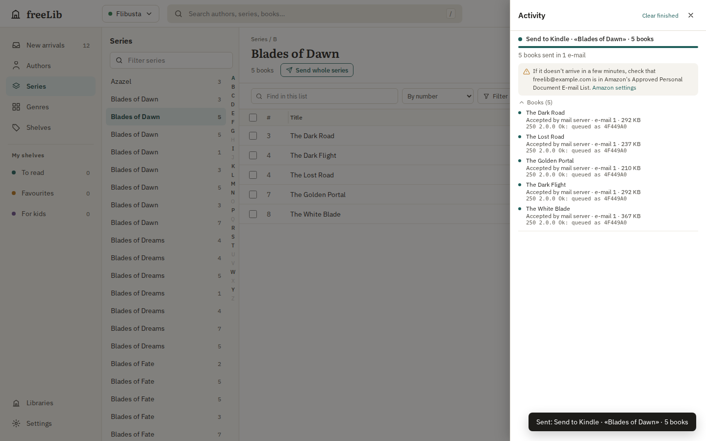
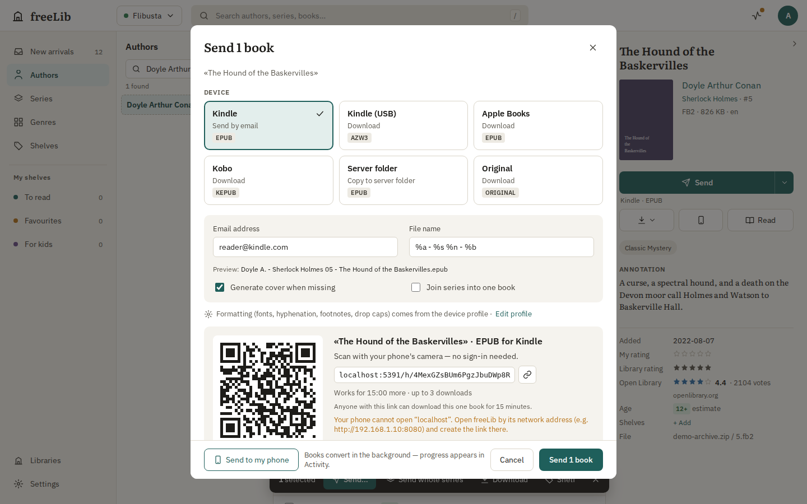

# freeLib Web — devices and delivery

How books get from the library onto a reader: the default devices and why their options are
what they are, what goes into every EPUB, e-mail batching and retries, the phone hand-off link,
and "Open in Books" on iPhone/iPad. The HTTP API is in [API.md](API.md).

## Default devices (presets)

A fresh install has six shared devices. Each remembers the preset it was seeded from
(`Device.preset`, read-only).

| Device | Preset | Kind / format | Footnotes | Hyphenation | Fonts | Why |
|---|---|---|---|---|---|---|
| Kindle | `kindle-email` | e-mail, EPUB | pop-up (`<aside epub:type="footnote">`) | soft (U+00AD from our dictionaries) | none embedded | Amazon's Send to Kindle converts EPUB itself; it turns `noteref`/`footnote` asides into Kindle pop-up notes. Kindle does not hyphenate Russian by itself, so soft hyphens make justified text readable. Kindle's own fonts and font menu work best, and embedded fonts only add size |
| Kindle (USB) | `kindle-usb` | download, AZW3 (Calibre) | pop-up | soft | none | Same book for sideloading; Calibre keeps aside notes as KF8 pop-ups and gets the metadata and cover explicitly (see below) |
| Apple Books | `apple-books` | download, EPUB | pop-up | full (soft + CSS `hyphens: auto`) | optional (none by default) | Apple Books shows EPUB 3 asides as pop-ups and hides them in the flow; CSS hyphenation lets its own dictionaries cover languages we have no dictionary for. An embedded font is a per-device choice (PT Serif is available) |
| Kobo | `kobo` | download, KEPUB | pop-up | full | none | KEPUB uses Kobo's own renderer (pop-up notes, reading statistics, faster page turns). Kobo's firmware hyphenates only a few languages, hence soft hyphens too |
| Server folder | `server-folder` | folder, EPUB | end notes with back links | soft | none | A generic EPUB for any app that picks books up from a folder (KOReader, Moon+, PocketBook, Calibre): end notes work everywhere |
| Original | `original` | download, original | – | – | – | The file as it is in the archive, never converted |

All presets use: cover generated when missing, annotation page, a new file per chapter, table
of contents at the end (readers open at the "bodymatter" landmark, so it does not delay the
first page), no drop caps, no transliteration.

**Upgrades.** Seeded devices carry a preset version. When a newer server ships better
defaults, they are applied at startup to every seeded device whose *conversion options* were
never changed through the API (`device.customized = 0`). Renaming a device or setting its
e-mail address does not count as a change; editing any conversion option does, and that
device then keeps its options for good. Devices seeded by older servers (before presets were
recorded) are recognised by their seeded name, kind and format with untouched default options.
Devices users create have no preset.

## What every EPUB carries

Conversions (`fb2conv`) take the catalog's view of the book (`BookMeta`) in addition to the FB2:

* **Stable identifier.** `dc:identifier` is `urn:uuid:` derived from the catalog `book_key`, so
  re-sending the same book replaces it on Kindle and Apple Books instead of adding a duplicate.
  Joined series use all keys of the joined books.
* **Language.** `dc:language` is the FB2 `<lang>` normalised to BCP 47 (`rus` → `ru`,
  `ru_RU` → `ru-RU`, `Русский` → `ru`), else the catalog language, else a guess from the title
  (Cyrillic → `ru`). Kindle picks dictionaries and hyphenation from it.
* **Title.** Cleaned: whitespace collapsed, format tags such as `(fb2)` or `[litres]` dropped,
  a trailing number repeating the series number removed ("Ночной дозор. Книга 1" → "Ночной
  дозор"), a single trailing period removed. A bare trailing number stays ("Метро 2033").
  Title sort (`file-as` on `dc:title`, `calibre:title_sort`) drops leading quotes and moves an
  English article to the end ("Hobbit, The").
* **Authors.** `dc:creator` in natural order with `file-as` "Last, First Middle"; translators
  as `dc:contributor` (`trl`).
* **Series.** EPUB 3 `belongs-to-collection` with `collection-type` = `series` and
  `group-position`, plus Calibre's `calibre:series` / `calibre:series_index` (Kindle's
  converter and Calibre read these; Apple Books groups by collection). The catalog's series
  wins over the FB2 `<sequence>`.
* **Description, publisher, date, ISBN.** The annotation as plain-text `dc:description`,
  `dc:publisher`, `dc:date` (full date when the FB2 has one, else the year), ISBN as a second
  identifier.
* **Cover.** The book's own cover when it is a complete, decodable image of a usable size
  (at least 100 px, not thinner than 1:4); a truncated JPEG/PNG (no end marker) counts as
  broken. Covers much larger than 1600×2560 or heavier than 1.5 MB are scaled to fit 1600×2560
  as JPEG. Otherwise a typographic cover is drawn: 1600×2560 (the 1:1.6 shape of Kindle, Apple
  Books and Kobo grids), flat colour picked from the title, PT Serif (full Cyrillic), author at
  the top, the title large and line-balanced in the middle (one- and two-letter words such as
  «в», «и» stick to the next word), series in italics and "Книга 3" at the bottom; a
  4:2:0 JPEG with optimised Huffman tables, about 100–150 KB (the old leather texture was
  ~330 KB at 780×1250). The cover is marked for every reader: the manifest item has
  `properties="cover-image"` (EPUB 3, Kobo, Apple Books), `<meta name="cover">` (EPUB 2,
  Kindle), an SVG-wrapped `cover.xhtml` first in the spine with the `cover` landmark and the
  legacy `<guide>` reference.

**AZW3/MOBI via Calibre.** The server reads the metadata back from its own EPUB and passes
`--title`, `--title-sort`, `--authors` (`&`-separated), `--author-sort`, `--series`,
`--series-index`, `--language`, `--publisher`, `--isbn`, `--pubdate`, `--book-producer` and
`--cover` (the EPUB's cover as a file) to `ebook-convert`, all as `--name=value` so a value
starting with `-` cannot be read as an option. Kindle shows these from the AZW3's EXTH header.

## Send to Kindle by e-mail

* **Batching.** A send job first converts every book, then packs the files into as few mails
  as the limits allow, in reading order: at most `smtp.maxAttachments` (default 25) per mail
  and `smtp.maxMailMb` (default 50) per mail — Amazon's documented limits for Send to Kindle
  by e-mail. The size counts the attachments as base64 (what mail servers measure), so 50 MB
  holds about 37 MB of books. Lower it when your SMTP provider allows less (Gmail: 25 MB). A
  book larger than one mail fails with a clear message. The daily limit
  (`smtp.dailyLimitPerUser`) counts mails, not books.
* **Whole series.** "Send whole series" (series pages, the selection bar, MCP `series_id`)
  sends the series' live books in reading order; of several editions with the same title and
  language only the newest is sent.
* **Retries.** Temporary failures — 4xx replies (e.g. `421`, `451`), timeouts, refused or
  dropped connections — are retried automatically, `smtp.retries` times (default 3), after
  `smtp.retryDelaySeconds` (default 30 s), then four times longer each time (30 s, 2 min,
  8 min). Permanent failures — 5xx replies such as a failed login (`535`) or a rejected
  recipient (`550`), TLS errors, an invalid address — are not retried.
* **Per-book delivery state.** `queued → converting → converted → sending` (handed to the mail
  server) `→ accepted` with the server's reply, e.g. `250 2.0.0 Ok: queued as 4F3A…`, or
  `retrying` (with the error and the next attempt) / `failed`. Folder exports end in `saved`,
  downloads in `ready`. The Activity panel and MCP `get_job` show them.
* **Approved senders.** After a successful mail to a `@kindle.com` address the job carries a
  hint: *"If it doesn't arrive in a few minutes, check that <from address> is in Amazon's
  Approved Personal Document E-mail List"* with a link to Amazon's settings page — Amazon
  silently drops mail from unknown senders.
* **Restarts.** Send, export and download jobs and their per-book results are stored in
  `app.db`. Jobs that were queued when the server stopped are resumed at startup; jobs that
  were running are marked failed with "Interrupted by a server restart" and can be retried.
  Retrying (`POST /jobs/:id/retry`, the Retry button) redoes only the books that did not get
  through; accepted books are not mailed twice.

## Send to my phone

The details pane (phone icon) and the Send dialog ("Send to my phone", one book) create a link
for the book in the chosen device's format and options (default: the Apple Books device, EPUB)
and show it as a QR code and a short URL. The phone opens a minimal page without signing in:
cover, title, author, series and a big **Open in Books** (iPhone/iPad) or **Download** button.

Security properties:

* The token is 128 random bits (22 base64url characters); `app.db` stores only its SHA-256, so
  a database copy does not reveal working links.
* A link works for **15 minutes** and **3 downloads** (viewing the page or the cover does not
  count, nor does `HEAD`; a failed conversion gives the download back).
* It is bound to one book, one format and the options chosen when it was made, and grants
  nothing else: no session, no other book, no API.
* It belongs to the user who made it: deleting the user deletes their links, downloads are
  recorded in their history.
* Creation is limited to 20 links per user per 10 minutes (429).
* The page and the file are `Cache-Control: no-store`, `Referrer-Policy: no-referrer`,
  `X-Robots-Tag: noindex`; the page has `default-src 'none'` (no scripts at all), the file the
  same `sandbox` CSP as every book file.
* Whoever sees the QR code or URL within those 15 minutes can download that one book — the
  same trust as handing someone the file. The link uses `FREELIB_PUBLIC_URL`, else the address
  the browser used; the dialog warns when that is `localhost`, which a phone cannot reach.

## Open in Books (iPhone, iPad)

On iOS and iPadOS (an iPad reports itself as a Mac with a touch screen) the details pane's
primary action becomes **Open in Books** when an Apple Books device exists (the other devices
stay in its menu), and choosing the Apple Books device in the Send dialog does the same. It
creates a hand-off link and navigates to its file, served as `application/epub+zip` with
`Content-Disposition: attachment` and the device's file name, so Safari downloads it and offers
to open it in Books. The link also works when the web app runs from the home screen, outside
Safari's signed-in session.
